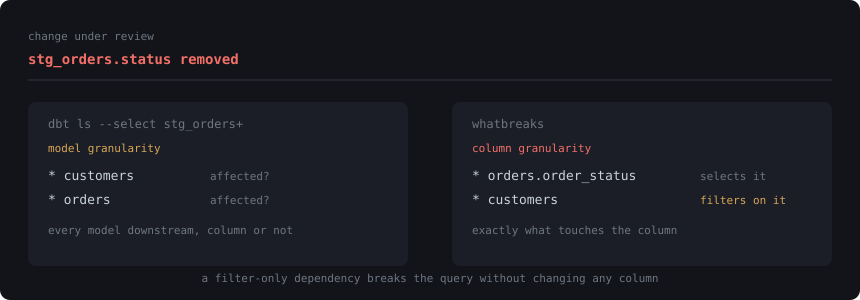

<div align="center">

# whatbreaks

**Know what a dbt change breaks — before you merge it.**

Column-level blast radius in CI. No warehouse, no secrets, no backend.

[](https://pypi.org/project/whatbreaks/)
[](https://github.com/Ridadata/whatbreaks/actions/workflows/ci.yml)
[](https://www.python.org/downloads/)
[](LICENSE)
[](#status)

<br>



<sub>Real CLI output. CI regenerates this image and fails if it has drifted.</sub>

</div>

<br>

## The problem

You remove a column. `dbt build` passes. Three hops downstream a dashboard breaks, and you find out
a week later from an angry Slack message.

`dbt ls --select model+` knows which **models** are downstream. It does not know which **columns**
are — so a change to one column flags every model beneath it, whether or not that column reaches
them. Technically correct, too coarse to act on.

<div align="center">

</div>

Both models are downstream. Only one *selects* the column — the other breaks because it **filters**
on it, which never shows up in the output schema at all. whatbreaks reports both, and says which is
which.

## Why not the existing tools

Column-level lineage for dbt is not new. `sqlglot` does the parsing and several good tools build on
it. The gap is that **every existing CI impact tool needs infrastructure**:

| Tool | Requires |
| :--- | :--- |
| [Recce](https://github.com/DataRecce/recce) | live warehouse + two dbt environments |
| [dbt-column-lineage](https://github.com/Fszta/dbt-column-lineage) | `catalog.json`, i.e. a warehouse |
| [SQLMesh](https://github.com/TobikoData/sqlmesh) | adopting SQLMesh as your framework |
| dbt Cloud Explorer | dbt Cloud, Enterprise tier |
| Datafold · Atlan · Sifflet · Metaplane | a hosted catalog (SaaS) |
| **whatbreaks** | **`dbt parse` output. Nothing else.** |

Because it needs no credentials, it can run on pull requests **from forks** — where `GITHUB_TOKEN`
is read-only and secrets are withheld.

If you already run Recce or Datafold, they answer a *different and often better* question — "did the
data actually change?" — by querying your warehouse. whatbreaks answers "what could break?"
statically, in seconds, for free.

## Try it

```bash
pip install whatbreaks        # or: uv tool install whatbreaks
```

Four runtime dependencies. No warehouse driver, no service, no account.

The repo ships a runnable example — no warehouse, no dbt install:

```bash
git clone https://github.com/Ridadata/whatbreaks && cd whatbreaks

whatbreaks check \
  --base examples/quickstart/base/target/manifest.json \
  --head examples/quickstart/head/target/manifest.json
```

That is the run in the demo above. See [`examples/quickstart`](examples/quickstart/) for what it
models.

## Use it on your project

You need two manifests — one from the base commit, one from your change. `dbt parse` produces them
offline, with no warehouse connection:

```bash
git worktree add ../base origin/main
(cd ../base && dbt parse)     # base
dbt parse                     # your change

whatbreaks check --base ../base/target/manifest.json --head target/manifest.json
```

| Flag | |
| :--- | :--- |
| `--fail-on breaking` | default — only confirmed breakage fails the run |
| `--fail-on possibly-breaking` | stricter |
| `--fail-on never` | report only, always exit `0` |
| `--format text \| json \| markdown` | humans · tooling · PR comments |

**Exit codes** — `0` clean · `1` findings at or above the threshold · `2` bad input (nothing analysed).

## Measured, not asserted

Across 7 public dbt projects (164 models), with **no warehouse**:

| | | |
| ---: | :--- | :--- |
| **75.6%** | of models resolve their output columns exactly | [method →](docs/adr/000-feasibility.md) |
| **83.5%** | have a usable schema | |
| **93.3%** | on analytics-style projects, the target population | |
| **0** | false positives on the no-op corpus | [15 cases →](tests/false_positives/) |
| **11.5s** | to analyse a 500-model project, cold | |

The 93.3% rests on 2 projects and 15 models — directionally right and under-evidenced. The package
subset (73.8%, a harder population) is the conservative floor. Full method and threats to validity
are in [ADR 000](docs/adr/000-feasibility.md); the scripts in [`tools/`](tools/) reproduce every
number here.

## What it reports

| Rule | Change | Severity |
| :--- | :--- | :--- |
| [WB001](docs/rules/WB001.md) | column removed | breaking · possibly · safe, by blast radius |
| [WB002](docs/rules/WB002.md) | model removed | breaking if still referenced |
| [WB003](docs/rules/WB003.md) | column added | safe |
| [WB900](docs/rules/WB900.md) | model could not be analysed | info |

Renames, type changes and expression changes are inference rather than fact. They wait for later
releases instead of shipping as guesses.

## How it works

Two `manifest.json` files in, findings out — no warehouse, no network:

**recover SQL** → **infer output columns** → **build column lineage** → **diff the two graphs**

The last step is the one that matters: it is a **graph** diff, not a text diff. Reformatting and CTE
renames produce nothing, and a model whose columns changed because an *upstream* `SELECT *` changed
is caught even though its own file was never touched.

[Full walkthrough →](docs/how-it-works.md)

## Honesty by design

- **Never overclaim.** Every finding carries a severity *and* an independent confidence. Coverage is
  always reported, so a clean result is never mistaken for a complete one.
- **Absence of evidence is not evidence of absence.** A removed column with no consumer is `safe`
  only when coverage is complete — otherwise `possibly_breaking`.
- **Deterministic.** No network calls, ever — enforced by a test that blocks sockets. No LLMs.

## Limitations

Explicit by design, not apology. Full list in **[docs/limitations.md](docs/limitations.md)**.

- Without `catalog.json`, `SELECT *` over a source with no declared columns cannot be expanded.
  Reported `partial`, never guessed. *(A star over a CTE resolves fine — most do.)*
- Macros needing a live warehouse (`run_query`, `adapter.get_relation`) are unresolvable offline and
  say so by name.
- Python models are out of scope, and are named as such rather than reported as a parse error.
- whatbreaks reasons about **schema**, not values. Whether your numbers changed is a different
  question, and Recce and Datafold answer it well.

## Status

**v0.1.0 — early, but real.** Tested against real dbt projects and honest about what it could not
analyse. Not yet here: the GitHub Action, rename and type-change detection, suppressions. The JSON
output carries its own `schema_version` so tooling can pin while the shape settles.

## Contributing

Found SQL whatbreaks gets wrong? **[A corpus case](tests/false_positives/README.md) is the most
useful possible bug report** — one YAML file, no code. It reproduces the problem, documents the
expectation, and becomes the regression test the moment it is fixed.

A break we *failed* to report is the more valuable half: false negatives mean someone merges a
breaking change believing it is safe. See [CONTRIBUTING.md](CONTRIBUTING.md).

---

<div align="center">
<sub>MIT licensed · <a href="CHANGELOG.md">Changelog</a> · <a href="docs/limitations.md">Limitations</a> · <a href="SECURITY.md">Security</a></sub>
</div>
